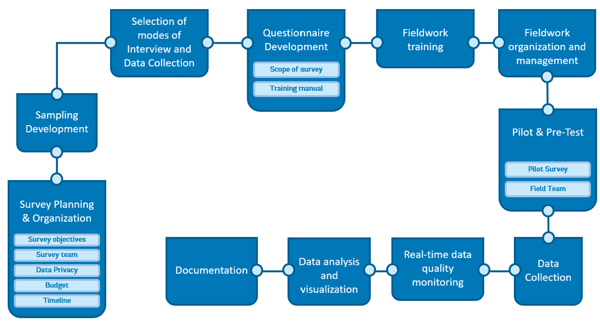
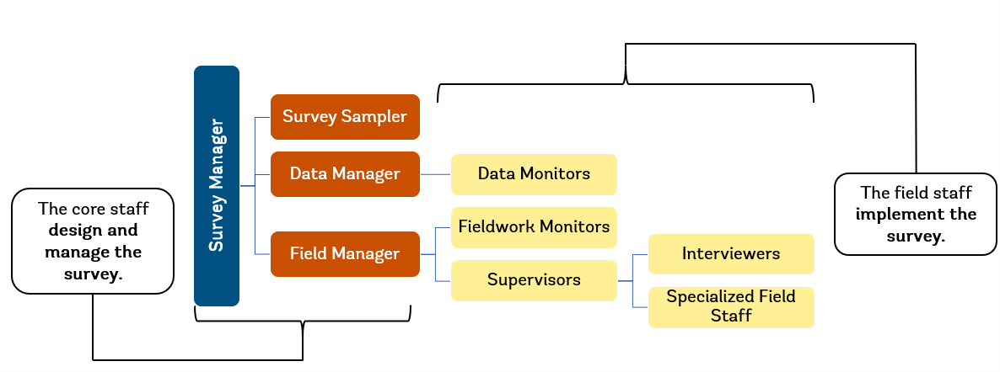

# Survey Planning

## Definition

Comprehensive survey planning is essential to producing accurate, valid, and policy-relevant data. A well-designed survey plan helps teams identify data gaps, define objectives, allocate resources efficiently, and minimize errors across all phases of the survey lifecycle---before, during, and after data collection.

Surveys are subject to measurement errors that reduce the accuracy of the survey estimates, which refers to the closeness of the estimate to the true population value. Where there is a discrepancy between the survey estimate value and true population value, the difference between the two is referred to as the error of the survey estimate which results from two types of error:

* **Sampling error**, which arises when only a part of the population is used to represent the whole population
* **Non-sampling error**, which can occur at any stage of a household survey and due to a variety of reasons

Proper survey planning is one of the most effective ways to minimize both types of error, while also ensuring budget efficiency, representativeness of the sample, and timely availability of data.

Non-sampling errors may arise from different sources and should be addressed at different stages of the survey. The main non-sampling errors are:

* Respondent fatigue: respondents become fatigued, inattentive, and distracted because of extremely long interviews (e.g. interviews exceeding 6 hrs.) or frequent interviews for an extended period (e.g. weekly interviews over 1 year)
* Interviewer errors: interviewers are unfamiliar with questionnaire content and important concepts (e.g., what is meant by employment), have low interviewing skills (e.g., insufficient probing), lack skills to properly conduct interviews (e.g. trouble navigating the tablets or tools used for the survey), lack profiles to properly conduct interviews (e.g. unfamiliar with the language or customs), or makes mistakes in recording the responses
* Interviewer effects: interviewer's characteristics, opinions or attitude may affect responses from the respondents. For example, the interviewer has unmatched gender to conduct interviews (e.g. male interviewers asking sensitive questions to female respondents) or showing expectations or assumption about what the response should be (e.g. aligned with gender and social norms)
* Questionnaire design: question does not elicit intended information, does not have clear and concise wordings, uses wrong reference periods, has ill-defined concepts (e.g., using household and family interchangeably), or does not explain key concepts to respondents (e.g. what household means)
* Data entry program issues: data entry program is poorly programmed, is not sufficiently tested and is not consistent with the questionnaire. For example, a question is missing, or it has wrong skips.

## Guidance and Recommendations

This guidance aligns with the World Bank Group Development Data Quality Policy and its 13 Data Quality Principles, including Relevance, Coherence and Comparability, Metadata Standards, and Responsible Innovation. Survey teams are encouraged to map their planning decisions to these principles throughout the survey lifecycle. The lifecycle diagram provides an overview of all survey phases and serves as an organizing framework for the guidance that follows.

**Figure 1.** Survey cycle

Source: Own elaboration

## Develop a Survey Plan

Before initiating a new data collection effort, teams should first consider why new data is needed. This includes identifying the specific data gaps that the survey will fill, assessing whether existing data sources are sufficient or have limitations that justify new collection, and defining what policy decisions or research questions the survey is intended to inform. This rationale should be documented and used as the foundation of the survey plan. Survey planning is also relevant to regularly implemented surveys within a national statistical system.

In order for the survey results to be accurate and valid, both sampling and non-sampling errors should be minimized. To minimize these errors, a comprehensive **Survey Plan** should be developed and followed. This plan includes all survey tasks and activities for all phases of the survey - before, during, and after data collection. This includes:

* Survey objectives
* Survey team
* Data privacy
* Budget
* Timeline
* Sampling Development
* Selection of modes of Interview and Data Collection
* Questionnaire Development
* Fieldwork training
* Fieldwork organization and management
* Real-time data quality monitoring
* Data analysis
* Documentation
* Metadata production
* Dissemination

The survey planning process should be informed by answers to the following questions:

1. Why is new data collection needed? What data gaps exist, and why are existing data sources insufficient?
2. What are the objectives of the survey? What are the questions to be answered with the survey data?
3. What is the target population? Is it rural or urban, for example?
4. What is the timeline of the survey activities?
5. What are the timing and the length of the fieldwork? When should the fieldwork start and how long should it run for?
6. What are the plans for training and quality assurance?
7. Who should be responsible for planning and executing each activity?
8. What is the budget required for the survey? How do design choices balance cost, respondent burden, and data quality implications?
9. Who will implement the survey?
10. What mode of data collection will be employed---pen-and-paper interviewing (PAPI), computer-assisted personal interviewing (CAPI), computer-assisted telephone interviewing (CATI), or mixed-mode?

### Survey Objectives

The first step to conducting a survey is to identify the survey objectives by considering questions such as "What is the purpose of this survey?" and "What are the key policy areas that the survey should inform?" Teams should also consider how the survey relates to existing datasets and whether the data will be comparable across time or with other surveys (coherence and comparability). The survey objectives will guide the survey planning and preparation including questionnaire design, tools to be used, sampling design, budget, mode of interview and data collection.

### Survey Team

One of the first tasks in planning a survey is structuring the survey team. The survey should comprise the core staff who will design and manage the survey, such as: the Survey Manager, Survey Sampler, Data Manager, and Field Manager, and the field staff who will implement the survey, such as: Interviewers, Supervisors, Data Entry Operators, Specialized Field Staff, Field Monitors, and Data Monitors. Some of the roles could be assumed by the same person, especially the core staff. The organizational chart below presents a basic survey team breakdown.

**Figure 2.** Survey team

****

Source: Own elaboration

Core staff:

* Survey Manager. The Survey Manager coordinates all the activities in the survey process, including survey planning, questionnaire design, survey implementation and post-data collection activities.
* Survey Sampler. The Survey Sampler is responsible for the sample methodology applied in the survey.
* Data Manager. The Data Manager manages the preparation of the CAPI program including validation checks and leads remote systematic monitoring.
* Field Manager. The Field Manager supervises all the fieldwork operations. When teams are in the field, this person is responsible for the central supervision of the teams and in-person monitoring.

Field staff:

* Interviewers. Interviewers administer survey questionnaires.
* Supervisors. Supervisors are responsible for the assigned team of Interviewers.
* Specialized Field Staff. Certain types of surveys require specialized field staff who are specifically trained to perform specific activities, such as translations, anthropometric measurements, medical sample collection, or soil sampling.
* Field Monitors. Field Monitors conduct in-person field visits to directly observe interviews (in-person monitoring) and provide timely feedback.
* Data Monitors. Data Monitors conduct remote systematic monitoring throughout the fieldwork operation to review incoming data, spot errors, review interviewer performance, and provide timely feedback.

The number of Supervisors and Interviewers required for the survey is usually determined by the size of the sample and the time allocated for completing the survey.

### Data Privacy

Any data collection that involves human subjects is subject to the ethical standards of social science research and should comply with the **Institutional Review Board (IRB)** in the country, or with other regional or international review boards as appropriate. National Statistical Offices (NSOs) usually have a National Statistical Act that guides survey activities including the protection of human subjects. Thus, surveys implemented by NSOs may not require IRB clearances.

**Informed consent by the survey respondent** to participate in the interview should always be obtained. Maintaining the confidentiality of the respondents should be a priority of the implementing organization. The questionnaire should include a statement about **data confidentiality** and require interviewers to read it in its entirety at the beginning of every interview.

### Budget

Preparing a budget is an iterative process alongside the development of the overall survey planning (see Budget template). All aspects of the survey have implications for the budget, including sample size, number of interviewers, length of fieldwork, length of questionnaire, and mode of interviewing and data collection.

Below are the major items that should be considered when preparing a survey budget:

* Transportation. When costing transportation, consider the terrain that field teams will visit, keeping in mind that in certain cases, boats, scooters/motorcycles, animals such as camels and donkeys, etc., may have to be hired.
* Remuneration. Ensure that the budget includes all core and field staff time.
* Staff travel expenses. All staff travel expenses such as per diem, accommodations, and/or meals for staff when they are in training or in the field should be included in the budget.
* Office equipment and stationery. Stationery (e.g., notebooks, pencils, pens, calculators, etc.), computers, printers, and software must be included in the budget.
* Printing. Even when using CAPI, certain documents may need to be printed, such as manuals, reference photo aids, final reports, pamphlets explaining the survey.
* Cell phone and data plans. Cell phone and data plans may be needed to ensure ease of communication between core and field staff and to transmit data from the field to headquarters.
* Training. Training venue(s) and audio/visual equipment as well as any other training related costs should be included in the budget.
* Field equipment. Fieldwork equipment such as tablets (for CAPI data collection), GPS devices, internet dongles, power banks, anthropometric scales, measuring boards, backpacks, survey uniforms, rain gear, and first aid kits must be included in the budget if they will be used in the survey.
* Souvenirs/Incentives. In some instances, respondents may be given souvenirs or incentives for their participation in the survey.
* Media communication. Some surveys may use media channels such as radio, TV, or newspapers to inform the public of the survey.
* Contingency. It is recommended to add a contingency item between 5 to 10 percent of the total cost for unexpected expenses.

### Timeline

It is advisable to develop a comprehensive timeline of activities for effective planning (see Timeline template). Ensure that every step, from preparation through to dissemination, is included, properly sequenced, and allocated sufficient time for completion. Certain activities may be influenced by external factors---such as school schedules, religious observances, or seasonal weather---which should be clearly reflected in the timeline.

### Sampling Development

One important step in the survey planning process is identifying the target population and sample requirements for the survey, based on the defined survey objectives. This should be done by a sampling expert who can provide different scenarios for selecting the sample. Depending on the sample design, a household listing exercise may be needed to update a sampling frame and to provide current information on household characteristics, particularly if a survey is targeting a specific group of people.

When an external sampling frame or third-party data source is used, teams should conduct due diligence to assess its quality, coverage, and timeliness. Any known limitations of the sampling frame should be documented and reflected in the survey plan.

### Modes of Interview & Data Collection

One more important step in the survey planning process is deciding the mode of interview and data collection. There are three main modes for conducting interviews: face-to-face interviewing, telephone interviewing, and self-administered questionnaires. Face-to-face interviewing remains the most common approach in low- and middle-income countries. Telephone interviewing, however, has become increasingly popular because it can reduce costs and support high-frequency data collection.

There are different modes of data collection:

**Pen-and-paper interviewing.** Pen-and-Paper Interviewing (PAPI) is the traditional mode of data collection. It uses a paper questionnaire to record respondents' answers.

**Computer-assisted interviewing.** In computer-assisted interviewing, the interviewer records responses in real time on a computer or tablet using a data entry application programmed with the questionnaire. When conducted in person, this is called Computer-Assisted Personal Interviewing (CAPI). When conducted by phone, it is called Computer-Assisted Telephone Interviewing (CATI).

**Self-administered interviewing.** Self-administered interviews allow respondents to read the questions and record their own answers. When the questionnaire is completed through a digital platform, this mode is called Computer-Assisted Web Interviewing (CAWI).

Teams should also consider how the selected mode affects data quality, cost, and respondent burden, and document the rationale for the chosen approach.

### Questionnaire Development

Designing the questionnaire needs to ensure that it meets the objective of the survey and should involve input from relevant stakeholders. It is recommended to always refer to guidelines on best practices and test the questionnaire in a pre-test (small-scale test) and a pilot.

Where possible, questionnaires should align with standard variable definitions and international classification systems to ensure coherence and comparability with other surveys and datasets. Any deviations from established standards should be documented and justified.

### Fieldwork Training

A **Training Plan** should be developed, including details on the number of trainees, modality of training, training stages, schedule and location. During the training, field staff should learn the objective of the survey and of each section and conduct a detailed review of the questionnaire to understand terms and concepts as well as familiarize themselves with the questions and their sequence. The field staff will also learn how to use the tools that will be used during fieldwork, such as tablets, measuring boards and scales for anthropometric measurements, and GPS devices.

### Fieldwork Organization and Management

The fieldwork for the main data collection is the core activity of the survey operations. All the preceding survey preparations and training are done to ensure smooth fieldwork operations that allow for the successful collection of high-quality data. The fieldwork implementation should follow the fieldwork plan and protocols to minimize survey errors from the field. Before the main data collection fieldwork starts, the plan and protocols should be tested in a pilot survey.

A **Fieldwork Plan** should include details on field team composition, their roles, special skills that may be needed (i.e. anthropometrics), number of teams, and fieldwork schedule. The fieldwork plan should also include guidelines to facilitate communication within and across teams in the field and in headquarters.

A **Fieldwork Protocol** should be developed to guide the field team in their interactions with communities and households. It should contain guidelines on etiquette for interviewing household members and how to protect their privacy. It should also specify the code of conduct, the guidance for ensuring the safety of the survey team and information on what to do in case of emergencies.

When survey implementation is contracted to an external firm, teams should embed quality controls in the contract, including requirements for data security, staff qualifications, and adherence to the survey protocol. Vetting of survey firms should be conducted prior to contracting.

### Real-time Data Quality Monitoring

The quality of the data is determined, in large measure, by the way in which the fieldwork is conducted. One of the key goals during data collection is to minimize non-sampling errors and the amount of cleaning and editing post-data collection. Implementing data checks during fieldwork and regular monitoring of field staff is essential to meeting this goal.

Effective monitoring requires the development of a data quality assurance system that includes an integrated approach of both human oversight and computer-based checks. Both must be timely, as it is far harder to correct mistakes after the fact than to obtain clarification while teams are still in the field.

The data quality assurance system should incorporate three levels of monitoring and be outlined in a **Monitoring Plan**:

* Monitoring through data entry program
* In-person monitoring
* Remote systematic interview monitoring

The CAPI application (data entry program) should incorporate validation conditions to be fully maximized as a monitoring tool. Validation conditions describe the conditions under which a response is valid and include range checks, internal consistency checks and completeness checks.

In-person monitoring is done by field monitors making field visits to directly observe interviews and provide timely feedback to the interviewers. A template should be developed for each activity the field monitor is expected to observe and report on. This will ensure that the monitoring is consistent across field monitors and interviewers.

In addition to monitoring through the data entry program and in-person visits, every completed interview should be reviewed by data monitors. Any spotted errors in the data should be communicated back to the interviewers while they are still in the field so that they can be verified directly with the households. To improve efficiency and to perform complex consistency checks, error check syntax (in R, Stata, etc.) can be developed and run on the incoming data.

When automated or machine-learning-based quality checks are used, teams should ensure transparency in how the tools function, document the algorithms applied, and assess the automated checks for potential bias. This approach aligns with the WBG's principles of responsible innovation.

### Metadata Production

Metadata production should begin at the start of the survey planning process and continue throughout the survey lifecycle, not solely at the end of data collection. The survey team should develop a Metadata Production Plan that specifies who is responsible for producing metadata, at what stages it will be generated, and which standards or templates will be used (e.g., DDI-Data Documentation Initiative). Structured, machine-readable metadata facilitates interoperability, discoverability, and long-term usability of the dataset.

### Documentation

Documentation starts from the very beginning of the survey planning process. Every aspect of the survey and materials developed must be documented and stored. All the information needed to understand the survey process, instruments, and data should be compiled into one document, commonly known as Basic Information Document (BID). This document should be disseminated with the dataset. In addition to the BID, documentation should include questionnaires, field staff manuals, and survey reports, all of which should be made available alongside the dataset to support reproducibility and transparency.

### Dissemination and Transparency

A Dissemination Plan should be developed as part of the survey planning process. This plan should specify the intended audiences, the formats in which findings will be shared (e.g., public reports, microdata release, policy briefs), the timeline for dissemination, and any access restrictions that apply to the data. Where microdata is intended for public release, the plan should address de-identification requirements and the terms of access. Dissemination materials, including metadata in DDI format, technical documentation, and manuals, should be made publicly available alongside the dataset to the extent permitted.

### Quality Improvement and Lessons Learned

At the conclusion of the survey, teams should conduct a lessons-learned review to identify what worked well and what could be improved in future surveys. Key findings from this review should be incorporated into the BID and used to inform the design of future data collection efforts. This feedback loop is essential to continuous quality improvement and to building institutional knowledge over time.

## References

Grosh, Margaret E. and Juan Munoz. 1996. A Manual for Planning and Implementing the Living Standards Measurement Study Survey. Living Standards Measurement Study Working Paper No. 126. Washington, DC: World Bank.

<https://documents.worldbank.org/en/publication/documents-reports/documentdetail/363321467990016291/a-manual-for-planning-and-implementing-the-living-standards-measurement-study-survey>

Statistics Canada. (2010). Survey Methods and Practices

<https://www150.statcan.gc.ca/n1/en/pub/12-587-x/12-587-x2003001-eng.pdf?st=vUWBkdUT>

Australian Bureau of Statistics (ABS). Errors in Statistical Data.

https://www.abs.gov.au/websitedbs/d3310114.nsf/home/Basic+Survey+Design+-+Errors+in+Statistical+Data
