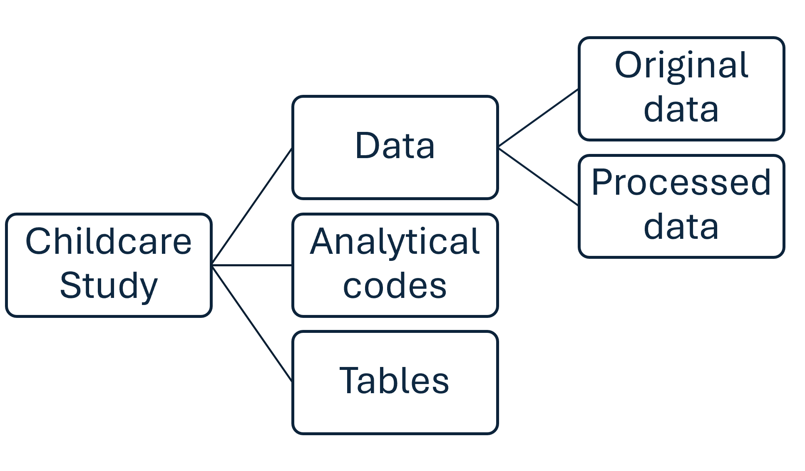

# Survey Data Analysis

## Definition

Survey data analysis is the systematic process of interpreting data collected to draw meaningful conclusions about a population. It should be done in a way that ensures reproducibility[^1] and replicability[^2]. Reproducibility requires that all analytical steps, from data processing to final outputs, are fully documented, that code and data are accessible and versioned, and that an independent analyst could obtain identical results using the same inputs. Replicability goes further, demanding that the core findings hold when the analysis is applied to new or independently collected data. Both standards require deliberate planning, rigorous documentation, and transparent disclosure of methods and limitations.Even though this activity is mainly conducted when the data has been collected and prepared, the development of a data analysis plan can start before the data collection starts.

[^1]: Reproducibility refers to the ability of an independent researcher or analyst to obtain the same results using the same data and analysis procedures as those originally employed. It requires that all steps—from data processing to statistical analysis—are documented and accessible so that the results can be duplicated exactly. Reproducibility is fundamental in scientific research and data analysis, as it helps ensure transparency and trust in the findings. (Lohr, S. L., 2019)

[^2]: Replicability is the degree to which consistent results are achieved when a study or analysis is repeated under similar conditions, but often with new data or different samples. Unlike reproducibility, which focuses on duplicating the same findings with the same dataset, replicability tests the broader validity of the conclusions by applying the research methods elsewhere. High replicability demonstrates that the findings are not specific to one particular dataset and can be generalized to a wider context. (Groves, R. M., et al, 2009)

The analysis should follow a series of structured steps:

1. Develop a data analysis plan: Begin by creating a comprehensive plan for analyzing the survey data.
   * Defining objectives and formulating key questions: Establish the main goals for the analysis and identify the specific questions that the analysis is intended to answer.
   * Reviewing the sampling design: Understand the structure of the sample to ensure that inferences drawn from the data are valid and representative of the intended population.
2. Conduct the analysis: Implement the planned analysis to draw insights from the data.
   * Presenting results: Share the results through outputs such as analytical reports, policy briefs, and academic publications.

## Guidance and Recommendations

### Preparing a Data Analysis Plan

Developing a well-structured data analysis plan is a crucial step in drawing useful insights from survey data. The following steps provide a comprehensive framework for preparing a data analysis
 plan.

**Step 1: Set data analysis objectives and identify key questions**

To begin preparing a data analysis plan, it's essential to set data analysis objectives and identify key questions the analysis aims to answer. Objectives should also specify the intended audiences for the outputs, for example, technical teams, policymakers, or donors, as this will shape subsequent decisions about methods, level of detail, and communication formats (see Section 2.2, Step 3).

::: {.callout-note}

**Box 1**

**Data Analysis Objectives and Key Questions Example**

*Objectives of data analysis*

* To understand the childcare arrangements of pre-primary age children

*Key Questions*

* What types of childcare arrangements do households use?
* What factors influence the choice of current childcare arrangements?
* What challenges or disadvantages do households identify that are associated with different types of arrangements?

:::

**Step 2: Identify variables**

Before starting, familiarize yourself with the datasets, which may be organized at various levels such as household, individual, plot, asset, or food item, depending on the survey topic. Consider how these datasets are structured and what key identifiers distinguish each observation.

Identifying the right variables is a foundational step in the data analysis process. To effectively address the key questions outlined in the objectives, analysts must carefully consider which variables within the dataset will provide meaningful and relevant insights.

In some cases, variables of interest may not be directly represented in the dataset. Analysts may need to create new composite variables by combining information from several fields, such as calculating the total number of children in a household from individual age data, or generating indicators for specific childcare challenges by aggregating multiple survey responses, following the example in Box 1. Additionally, external data sources might be consulted to enrich the analysis, for example, by linking geographic codes to regional characteristics or socioeconomic indices.

Where composite variables or derived indicators are constructed, all derivation logic must be documented in the analysis code and in accompanying metadata. This includes the source variables used, the transformation applied, and any assumptions made. See Section 2.2, Step 2 for documentation requirements.

**Step 3: Review of the sampling structure and weights**

The sampling structure and the use of weights should be taken note of[^3] to ensure that the analysis accurately reflects the population groups the survey was designed to represent. Analysts should document how weights were applied, verify that weight variables are correctly specified in the statistical software, and flag any departures from the intended weighting approach. Incorrect application of survey weights is a common source of error that can lead to substantially biased estimates; formal peer review of weighting decisions is strongly encouraged (see Step 4 and Section 2.2, Step 2).

[^3]: This may not be applicable in a small-scale non-representative study. 

**Step 4: Select appropriate methods for analysis**

Once the relevant variables have been identified, it is essential to determine the most suitable analytical methods that align with the objectives of the study. The choice of methods is influenced by the type of questions being asked, whether the goal is to describe, compare, or explain patterns.

Continuing with the example on childcare arrangements analysis (in Box 1), analysts may begin with descriptive statistics to summarize the prevalence and types of childcare arrangements used by households. This includes calculating frequencies, percentages, and measures of central tendency, such as means or medians, to provide an overview of the data. Visualization tools, such as bar charts or pie graphs, can be used to illustrate the distribution of childcare arrangements across different groups.

For more in-depth exploration, inferential statistical techniques can be employed to test hypotheses about factors that influence the choice of childcare arrangements. This might include cross-tabulations to examine associations between household characteristics (e.g., income, education level, number of children) and types of childcare used, or regression analysis to model the impact of specific variables on childcare decisions while controlling for others.

When the objective is to understand causality, such as determining whether a particular challenge directly leads households to choose one arrangement over another, advanced methods like logistic regression, propensity score matching, or even structural equation modeling may be appropriate.

Moreover, analysts could plan for disaggregation of results by key subgroups, such as gender, age, or geographic region, to uncover meaningful patterns that might be obscured in summary statistics. Where results are disaggregated across time or geographies, analysts should apply consistent definitions and classifications to ensure comparability. Where available, standard institutional definitions should be used, for example, welfare aggregates, or geographic codes consistent with standard classification systems such as ISIC, ISCED, or approved institutional geographic codes. For multi-year or cross-country analyses, analysts should document harmonization procedures explicitly, noting any definitional changes or breaks in series that may affect comparability.

Throughout the process, it is important to consider the limitations of the data and the methods, including potential biases in sampling or measurement, and to apply appropriate statistical tests (e.g., tests of significance) to confirm that observed patterns are unlikely to be due to random variation. Analysts should also identify and plan to disclose any material data quality issues known at the time of the analysis, such as significant item non-response, unit non-response patterns, sampling frame coverage gaps, or measurement error concerns, as these must be transparently reported in all analytical outputs (see Section 2.2, Step 3).

**Step 5: Prepare tabulation and visualization plans**

To ensure the findings are communicated effectively, it is essential to develop a comprehensive plan for how the data will be presented. This may include a detailed tabulation plan and visualization plan.

A detailed tabulation plan will specify the layout of each table, including column and row headings, categories for analysis, and any derived variables or composite indicators. For example, in a survey examining childcare arrangements, tables could be organized to show the frequency of different arrangement types by household income, parental education, or region.

|  |  |  |  |  |  |
| --- | --- | --- | --- | --- | --- |
| **Primary caregiver for children in the last 7 days** | | | | | |
|  | **Household Income (wealth index)** | | | | |
| 1st Quintile | 2nd Quintile | 3rd Quintile | 4th Quintile | 5th Quintile |
| Household Member |  |  |  |  |  |
| Non-household Member |  |  |  |  |  |
| Childcare Setting |  |  |  |  |  |

Equally important is the visualization plan. Choosing appropriate visual formats, such as bar charts for categorical comparisons, pie charts for proportions, line graphs to depict trends, or heatmaps for geographic patterns, helps communicate findings effectively to both technical and non-technical audiences.

### Conducting the data analysis

Conducting effective data analysis should involve maintaining a well-structured file management system, carefully documenting each step, and presenting findings in a way that ensures transparency, reproducibility, and relevance to the intended audience. It also requires responsible handling of data throughout the analytical process, including adherence to applicable data protection, confidentiality, and ethical handling requirements.

**Step 1: Organizing your folders**

Start by organizing your project with a clear folder and file structure. To ensure reproducibility, the processed dataset must be kept separately from the original dataset. Consider these questions when organizing the folders: Where will you save your original and processed datasets? Where will you store the file containing your analytical codes for easy access? Where will you save your output tables? Continuing with the example of the childcare arrangements analysis, below is an example folder structure for the study.

{#fig-folder-structure}

**Step 2: Analysis and Documentation**

The analysis plan should be followed, and all variable transformations and calculations must be documented to ensure transparency and reproducibility. Regardless of the statistical software used for data analysis, detailed records of the analytical steps taken are essential. For instance, in Stata, analytical codes are saved in do-files.

Documentation should meet minimum standards to support verifiability. At a minimum, analytical scripts and associated metadata should capture:

* A description of each variable derivation, including the source variables, the transformation logic, and any assumptions applied.
* The weighting algorithm used, including the name of the weight variable, the survey design specification (e.g., strata and cluster identifiers), and any adjustments made.
* Any sampling corrections or post-stratification adjustments.
* The software version and key package or ado-file versions used.
* Dates of data extraction or data version identifiers, so that results can be traced back to a specific data vintage.

Version control should be used throughout the analytical process. Maintaining an audit trail of script revisions, for example through Git or a comparable version control system, enables analysts and reviewers to track changes, understand when and why decisions were made, and support verification by others. Any corrections or material revisions to a completed analysis should also be documented, with a clear record of what changed and why.

The World Bank maintains institutional resources to support reproducibility, including a repository for reproducible research scripts and associated metadata standards for documentation. Analysts are encouraged to consult these resources when preparing their analytical packages.

Analytical outputs should be subject to formal review before dissemination. This includes peer review of key methodological choices, including weighting, variable construction, and analytical method selection, to reduce the risk of erroneous estimates, misapplication of weights, or use of inappropriate methods.

**Step 3: Presenting results**

When the analysis is completed, it is crucial to present the results in a format that aligns with the needs and expectations of the intended audience. This may involve preparing comprehensive documents such as detailed technical reports, concise policy briefs, or scholarly academic papers. The choice of format should be guided by the tabulation and visualization plans developed during the analysis planning phase, ensuring that the presentation of findings is both clear and impactful.

For example, a detailed report might include in-depth tables, charts, and narrative explanations suitable for technical readers or stakeholders who require a thorough understanding of the data and methods. Policy briefs, on the other hand, should distill key findings and recommendations into an accessible summary, using straightforward language and prominent visuals to facilitate quick decision-making by policymakers. Academic papers typically require rigorous methodological detail, comprehensive literature references, and precise data presentation, following the conventions of scholarly publishing.

Regardless of the format, it is important to tailor the content, level of detail, and style of visualizations to the audience's familiarity with the data and the questions they are likely to have. Clear documentation of analytical steps and transparent presentation of results will help ensure that the findings are both credible and useful. Engaging visuals, such as graphs, infographics, and summary tables, should be used to highlight patterns, trends, and key takeaways.

All analytical outputs, regardless of format or audience, should include a dedicated section on data quality, limitations, and caveats. This section should:

* Disclose any material data quality issues identified during the analysis, such as high rates of item non-response, unit non-response, known sampling frame gaps, or measurement concerns.
* Describe the known limitations of the analytical methods chosen, including any assumptions required and conditions under which findings may not generalize.
* Note any known or potential sources of bias, and explain how they were addressed or mitigated.
* Reference any revisions or corrections made to previously published versions of the analysis, with a brief explanation of what changed.

Analysts should also note that the institution's Access to Information Policy, and equivalent policies in other organizations, may govern what analytical outputs can be shared publicly, with whom, and under what conditions. Outputs should be prepared with awareness of these obligations.

**Step 4: Data archiving and dissemination**

Following the completion of analysis and dissemination of outputs, the underlying data and analytical materials should be deposited in an appropriate institutional repository in accordance with the institution's Development Data Archiving and Dissemination Procedure. Key requirements under this procedure include:

* Depositing data within the timelines specified by the applicable procedure.
* Including complete metadata, covering the survey instrument, sampling design, weighting approach, variable definitions, and analytical code.
* Ensuring that data are managed for long-term preservation and future dissemination, including appropriate access controls where confidential data are involved.

Timely archiving supports future replication, enables others to build on completed work, and fulfills institutional accountability obligations. Analysts should familiarize themselves with the applicable archiving requirements early in the project cycle.

Implementing data analysis in a research project involves a systematic approach to organizing files, documenting analytical steps, and presenting results effectively. By establishing a clear folder structure and maintaining detailed records of data transformations, researchers can ensure transparency and reproducibility throughout the process. Careful planning and tailored presentation of findings are essential for producing credible and actionable insights that meet the needs of diverse audiences. Adherence to institutional standards for documentation, data quality disclosure, responsible data management, and archiving further ensures that analytical work contributes to a verifiable, coherent, and comparable body of evidence over time.

## References

Bennett, C., Khangura, S., Brehaut, J. C., Graham, I. D., Moher, D., Potter, B. K, et al. (2011) Reporting Guidelines for Survey Research: An Analysis of Published Guidance and Reporting Practices. PLoS Med 8(8): e1001069. <https://doi.org/10.1371/journal.pmed.1001069>

Deaton, A. (2018). *The Analysis of Household Surveys: A Microeconometric Approach to Development Policy* (Reissue ed.). Washington, DC: World Bank. https://doi.org/10.1596/978-1-4648-1331-3

Draugalis, J. R., Coons, S. J., & Plaza, C. M. (2008). Best practices for survey research reports: a synopsis for authors and reviewers. *American journal of pharmaceutical education*, *72*(1). <https://doi.org/10.5688/aj720111>

Groves, R. M., Fowler, F. J., Couper, M. P., Lepkowski, J. M., Singer, E., & Tourangeau, R. (2009). Survey Methodology (2nd Edition). Wiley.

Hill, J., Chuko, J., Ogle, K., Gottlieb, M., Santen, S. A., & Artino, A. R., Jr (2024). Best practices for reporting survey-based research. AEM education and training, 8(1), e10929. https://doi.org/10.1002/aet2.10929

Lohr, S. L. (2019). Sampling: Design and Analysis (2nd Edition). Chapman & Hall/CRC.

Sharma, A., Minh Duc, N., Luu Lam Thang, T. et al. (2021). A Consensus-Based Checklist for Reporting of Survey Studies (CROSS). J GEN INTERN MED 36, 3179-3187. <https://doi.org/10.1007/s11606-021-06737-1>
